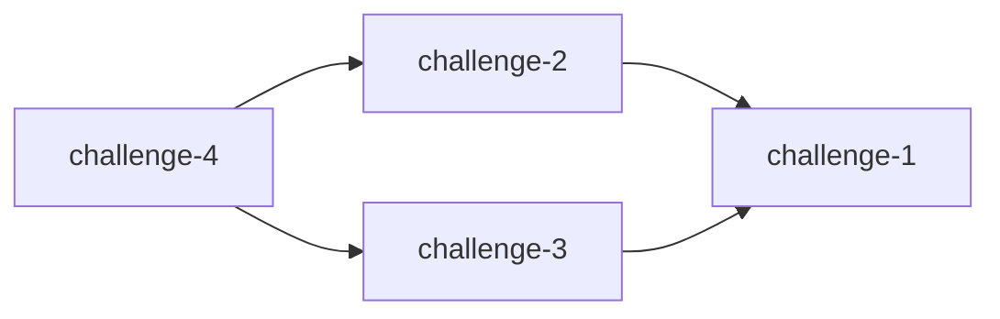
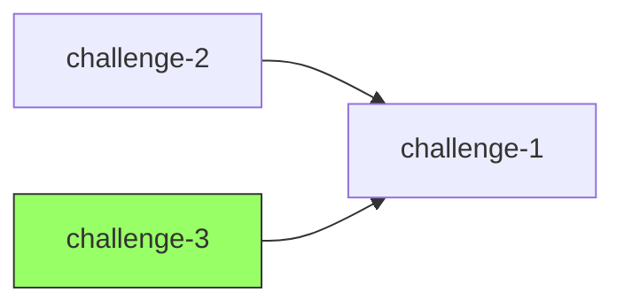

# Challenge Dependencies

A tool to visualize challenge dependencies in Mermaid graph format, designed to work both locally and in GitHub Actions.

## Project Overview

This tool analyzes CTF challenge directories, parses their dependency requirements from `challenge.yml` files, and generates a Mermaid dependency graph. It compares changes between the main branch and the current branch to visualize what will be merged.

## Architecture

### Directory Structure

```
.
├── CLAUDE.md                    # This file
├── README.md                    # User-facing documentation
├── Makefile                     # Build, test, lint, format commands
├── go.mod                       # Go module definition
├── go.sum                       # Go dependencies lock file
├── .github/
│   └── workflows/
│       └── ci.yml              # GitHub Actions workflow
├── cmd/
│   └── challenge-deps/
│       └── main.go             # CLI entry point
├── internal/
│   ├── parser/
│   │   ├── parser.go           # YAML parser for challenge.yml
│   │   └── parser_test.go
│   ├── graph/
│   │   ├── graph.go            # Dependency graph builder
│   │   └── graph_test.go
│   ├── git/
│   │   ├── git.go              # Git operations (branch comparison)
│   │   └── git_test.go
│   └── mermaid/
│       ├── mermaid.go          # Mermaid diagram generator
│       └── mermaid_test.go
├── pkg/
│   └── models/
│       └── challenge.go        # Challenge data models
└── testdata/
    └── sample-repo/            # Sample challenge repository
        ├── web/
        │   ├── challenge-1/
        │   │   ├── challenge.yml
        │   │   └── solution.json
        │   └── challenge-2/
        │       ├── challenge.yml
        │       └── solution.json
        ├── crypto/
        │   └── challenge-3/
        │       └── challenge.yml
        └── pwn/
            └── challenge-4/
                └── challenge.yml
```

### Core Components

#### 1. Parser (`internal/parser`)
- Reads `challenge.yml` files from challenge directories
- Parses YAML structure into Go structs
- Validates challenge metadata

#### 2. Git Operations (`internal/git`)
- Compares main branch with current branch
- Identifies added/modified challenges
- Determines post-merge challenge list
- Works in both local and CI environments

#### 3. Graph Builder (`internal/graph`)
- Builds dependency graph from challenge requirements
- Detects circular dependencies
- Validates dependency integrity
- Topological sorting for proper ordering

#### 4. Mermaid Generator (`internal/mermaid`)
- Converts dependency graph to Mermaid syntax
- Formats graph for readability
- Supports different graph layouts (LR, TB)

### Challenge YAML Format

```yaml
name: challenge-2
requirements:
  - "challenge-1"
  - "challenge-0"  # Can have multiple dependencies
```

### Dependency Graph Example

Given challenges:
- `web/challenge-1`: no dependencies
- `web/challenge-2`: requires `challenge-1`
- `crypto/challenge-3`: requires `challenge-1`
- `pwn/challenge-4`: requires `challenge-2`, `challenge-3`

Generates Mermaid:


## Development Workflow

### Prerequisites

- Go 1.21 or later
- git
- make

### Getting Started

```bash
# Install dependencies
go mod download

# Run tests
make test

# Run linter
make lint

# Format code
make format

# Build binary
make build

# Run locally
./bin/challenge-deps --repo ./testdata/sample-repo --base main --head feature-branch
```

### Makefile Targets

- `make test`: Run all tests with coverage
- `make lint`: Run golangci-lint
- `make format`: Format code with gofmt and goimports
- `make build`: Build the binary
- `make clean`: Clean build artifacts
- `make all`: Run format, lint, test, and build

### Testing Strategy

#### Unit Tests
- Each package has comprehensive unit tests
- Use table-driven tests for multiple scenarios
- Mock external dependencies (git commands, file system)

#### Integration Tests
- Test end-to-end flow with `testdata/sample-repo`
- Verify Mermaid output format
- Test GitHub Actions environment variables

#### Test Coverage
- Maintain >80% code coverage
- Use `go test -cover` to verify

### Git Workflow

1. **Local Development**
   ```bash
   git checkout -b feature/new-feature
   # Make changes
   make all  # Ensure everything passes
   git commit -m "feat: add new feature"
   ```

2. **GitHub Actions**
   - Runs on pull requests
   - Executes: lint, test, build
   - Generates dependency graph as PR comment
   - Fails if circular dependencies detected

### Code Style Guidelines

#### General Principles
- Follow [Effective Go](https://golang.org/doc/effective_go)
- Use meaningful variable names
- Keep functions small and focused
- Document exported functions and types

#### Error Handling
```go
// Good: Return errors, don't panic
func parseChallenge(path string) (*Challenge, error) {
    data, err := os.ReadFile(path)
    if err != nil {
        return nil, fmt.Errorf("failed to read file: %w", err)
    }
    // ...
}

// Bad: Panic on errors
func parseChallenge(path string) *Challenge {
    data := os.ReadFile(path)  // panics on error
    // ...
}
```

#### Testing
```go
// Good: Table-driven tests
func TestParseDependencies(t *testing.T) {
    tests := []struct {
        name    string
        input   []byte
        want    []string
        wantErr bool
    }{
        {
            name:  "single dependency",
            input: []byte("requirements:\n  - challenge-1"),
            want:  []string{"challenge-1"},
        },
        // More test cases...
    }

    for _, tt := range tests {
        t.Run(tt.name, func(t *testing.T) {
            // Test implementation
        })
    }
}
```

#### Package Organization
- `cmd/`: Entry points (main packages)
- `internal/`: Private application code
- `pkg/`: Public library code (reusable)
- `testdata/`: Test fixtures

## Implementation Details

### Git Branch Comparison

The tool uses git commands to determine merged challenges:

```bash
# Get files in main branch
git ls-tree -r --name-only main

# Get files in current branch
git ls-tree -r --name-only HEAD

# Compare to find added/modified challenges
```

In GitHub Actions, uses environment variables:
- `GITHUB_BASE_REF`: Base branch (usually main)
- `GITHUB_HEAD_REF`: Current branch
- `GITHUB_WORKSPACE`: Repository path

### Challenge Discovery Algorithm

1. Walk the repository directory tree
2. Find all `challenge.yml` files
3. For each file:
   - Parse YAML content
   - Extract challenge name and requirements
   - Store in graph structure
4. Build dependency edges
5. Validate no circular dependencies
6. Generate Mermaid output

### Circular Dependency Detection

Uses DFS-based cycle detection:

```go
func (g *Graph) detectCycle() error {
    visited := make(map[string]bool)
    recStack := make(map[string]bool)

    for node := range g.nodes {
        if err := g.dfs(node, visited, recStack); err != nil {
            return err
        }
    }
    return nil
}
```

### Mermaid Output Format



## GitHub Actions Integration

### Workflow Triggers
- Pull request opened/synchronized
- Push to feature branches
- Manual workflow dispatch

### Environment Setup
```yaml
steps:
  - uses: actions/checkout@v4
    with:
      fetch-depth: 0  # Full history for git comparison

  - uses: actions/setup-go@v6.4
    with:
      go-version: '1.21'

  - name: Run tests
    run: make test

  - name: Generate dependency graph
    run: |
      make build
      ./bin/challenge-deps --repo . --base ${{ github.base_ref }} --head ${{ github.head_ref }}
```

### Output as PR Comment
The workflow can post the Mermaid graph as a comment:

```yaml
  - name: Comment PR
    uses: actions/github-script@v7
    with:
      script: |
        const graph = require('fs').readFileSync('output.md', 'utf8');
        github.rest.issues.createComment({
          issue_number: context.issue.number,
          owner: context.repo.owner,
          repo: context.repo.repo,
          body: graph
        });
```

## Error Handling

### Common Errors

1. **Circular Dependencies**
   - Exit code: 1
   - Message: "Circular dependency detected: challenge-A -> challenge-B -> challenge-A"

2. **Missing Dependency**
   - Exit code: 2
   - Message: "Challenge 'challenge-2' requires 'challenge-1' which does not exist"

3. **Invalid YAML**
   - Exit code: 3
   - Message: "Failed to parse challenge.yml: invalid YAML syntax"

4. **Git Errors**
   - Exit code: 4
   - Message: "Failed to compare branches: not a git repository"

## Performance Considerations

- Use `filepath.WalkDir` for efficient directory traversal
- Parse YAML files concurrently with goroutines
- Cache git operations to avoid repeated commands
- Limit graph size for large repositories (>1000 challenges)


### GitHub Actions Failing

1. Check workflow logs for specific error
2. Verify `fetch-depth: 0` is set for git operations
3. Ensure base and head refs are correct
4. Test locally with same branch names
