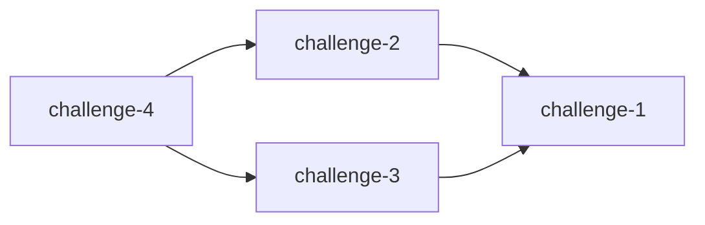

# Challenge Dependencies

Visualize CTF challenge dependencies as Mermaid graphs. Works locally and in GitHub Actions.

## Installation

```bash
go build -o bin/challenge-deps ./cmd/challenge-deps
```

## Usage

```bash
# Analyze current branch only
./bin/challenge-deps --repo ./testdata

# Compare two branches
./bin/challenge-deps --repo ./testdata --base main --head feature-branch
```

### Options

- `--repo`: Challenge repository path (required)
- `--base`: Base branch (optional, requires --head)
- `--head`: Head branch (optional, requires --base)
- `--format`: Output format: `markdown`, `mermaid`, `summary` (default: `markdown`)
- `--direction`: Graph direction: `LR`, `TB`, `RL`, `BT` (default: `LR`)

## Challenge Format

Each challenge needs a `challenge.yml`:

```yaml
name: challenge-2
requirements:
  - challenge-1
```

## Output Example



## GitHub Actions

See `.github/workflows/ci.yml` for integration example. The tool automatically detects `GITHUB_BASE_REF` and `GITHUB_HEAD_REF` environment variables.

## Development

```bash
# Run tests
go test ./...

# Build
go build -o bin/challenge-deps ./cmd/challenge-deps
```
