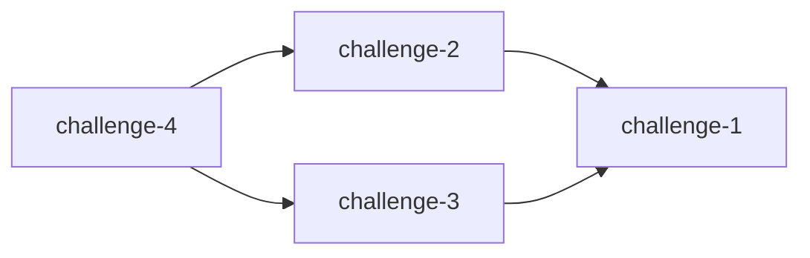

# Challenge Dependencies

Visualize CTF challenge dependencies as Mermaid graphs. Works locally and in GitHub Actions.

## Installation

```bash
go build -o bin/challenge-deps ./cmd/challenge-deps
```

## Usage

```bash
# Analyze current branch only
./bin/challenge-deps --repo ./testdata

# Compare two branches
./bin/challenge-deps --repo ./testdata --base main --head feature-branch
```

### Options

- `--repo`: Challenge repository path (required)
- `--base`: Base branch (optional, requires --head)
- `--head`: Head branch (optional, requires --base)
- `--format`: Output format: `markdown`, `mermaid`, `summary` (default: `markdown`)
- `--direction`: Graph direction: `LR`, `TB`, `RL`, `BT` (default: `LR`)

## Challenge Format

Each challenge needs a `challenge.yml`:

```yaml
name: challenge-2
requirements:
  - challenge-1
```

## Output Example



## GitHub Actions

### Use as an Action

Use this action in your workflow to analyze challenge dependencies:

```yaml
- name: Analyze dependencies
  uses: diver-osint-ctf/challenge_dependencies@main
  with:
    repo: '.'
    base: 'main'
    head: 'HEAD'
    format: 'markdown'

- name: Analyze current branch only
  uses: diver-osint-ctf/challenge_dependencies@main
  with:
    repo: '.'
    format: 'summary'
```

### Inputs

- `repo`: Repository path (default: `.`)
- `base`: Base branch for comparison (optional)
- `head`: Head branch for comparison (optional)
- `format`: Output format - `markdown`, `mermaid`, `summary` (default: `markdown`)
- `direction`: Graph direction - `LR`, `TB`, `RL`, `BT` (default: `LR`)

### Outputs

- `graph`: Generated dependency graph
- `summary`: Text summary of dependencies

### Complete Example

```yaml
name: Check Dependencies

on:
  pull_request:
    branches: [ main ]

jobs:
  analyze:
    runs-on: ubuntu-latest
    steps:
      - uses: actions/checkout@v4
        with:
          fetch-depth: 0

      - name: Analyze dependencies
        id: deps
        uses: diver-osint-ctf/challenge_dependencies@main
        with:
          repo: '.'
          base: ${{ github.base_ref }}
          head: ${{ github.head_ref }}

      - name: Comment PR
        uses: actions/github-script@v7
        with:
          script: |
            github.rest.issues.createComment({
              issue_number: context.issue.number,
              owner: context.repo.owner,
              repo: context.repo.repo,
              body: '${{ steps.deps.outputs.graph }}'
            });
```

See `.github/workflows/ci.yml` for the CI/CD pipeline example.

## Development

```bash
# Run tests
go test ./...

# Build
go build -o bin/challenge-deps ./cmd/challenge-deps
```
