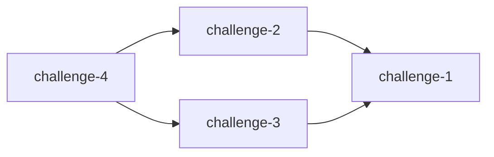

# Challenge Dependencies

Visualize CTF challenge dependencies as Mermaid graphs. Works locally and in GitHub Actions.

## Installation

```bash
make build
```

## Usage

```bash
# Analyze current branch only
./bin/challenge-deps --repo ./testdata

# Compare two branches
./bin/challenge-deps --repo ./testdata --base main --head feature-branch
```

### Options

- `--repo`: Challenge repository path (required)
- `--base`: Base branch (optional, requires --head)
- `--head`: Head branch (optional, requires --base)
- `--format`: Output format: `markdown`, `mermaid`, `summary` (default: `markdown`)
- `--direction`: Graph direction: `LR`, `TB`, `RL`, `BT` (default: `LR`)

## Challenge Format

see [testdata](./testdata)

## Output Example



## GitHub Actions

```yaml
name: Check Dependencies

on:
  pull_request:
    branches: [main]
  issue_comment:
    types:
      - created

jobs:
  analyze:
    if: |
      github.event_name == 'pull_request' ||
      (
        github.event_name == 'issue_comment' &&
        github.event.issue.pull_request &&
        contains(github.event.comment.body, '@github deps')
      )
    runs-on: ubuntu-latest
    steps:
      - name: Set PR info
        run: |
          if [[ "${{ github.event_name }}" == "pull_request" ]]; then
            echo "BRANCH_NAME=${{ github.event.pull_request.head.ref }}" >> $GITHUB_ENV
            echo "BASE_REF=${{ github.base_ref }}" >> $GITHUB_ENV
          else
            BRANCH_NAME=$(gh pr view ${{ github.event.issue.number }} --json headRefName --jq .headRefName --repo ${{ github.repository }})
            BASE_REF=$(gh pr view ${{ github.event.issue.number }} --json baseRefName --jq .baseRefName --repo ${{ github.repository }})
            echo "BRANCH_NAME=${BRANCH_NAME}" >> $GITHUB_ENV
            echo "BASE_REF=${BASE_REF}" >> $GITHUB_ENV
          fi
        env:
          GH_TOKEN: ${{ github.token }}

      - uses: actions/checkout@v4
        with:
          ref: ${{ env.BRANCH_NAME }}
          fetch-depth: 0 # Required for branch comparison

      - name: Fetch base branch
        run: git fetch origin ${{ env.BASE_REF }}

      - name: Analyze dependencies
        id: deps
        uses: diver-osint-ctf/challenge_dependencies@main
        with:
          repo: "."
          base: "origin/${{ env.BASE_REF }}"
          head: "HEAD"

      - name: Comment PR
        uses: actions/github-script@v8
        env:
          GRAPH_OUTPUT: ${{ steps.deps.outputs.graph }}
        with:
          script: |
            github.rest.issues.createComment({
              issue_number: context.issue.number,
              owner: context.repo.owner,
              repo: context.repo.repo,
              body: process.env.GRAPH_OUTPUT
            });
```
